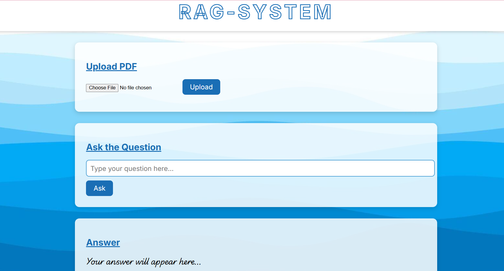
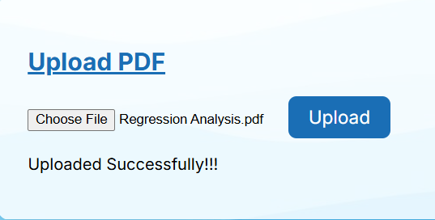
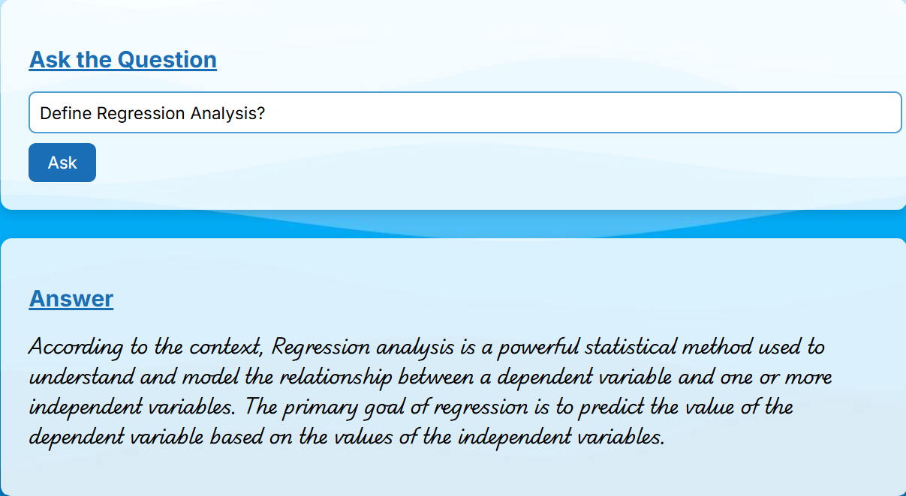

# 🧠 RAG-SYSTEM — Retrieval-Augmented Generation with Local LLMs



> Upload any PDF. Ask anything. Get intelligent, context-aware answers — powered entirely by local AI.

---

## 📸 Screenshots

| Upload PDF | Ask & Answer |
|---|---|
|  |  |

> *Full application view running on localhost:5000*

.png)

---

## 🚀 What Is This?

**RAG-SYSTEM** is a fully local Retrieval-Augmented Generation (RAG) pipeline built with Python and Flask. It lets you upload any PDF document and then ask natural language questions about it — with answers generated by a real 4.7GB local LLM (Llama 3), not a cloud API.

No OpenAI. No data leaving your machine. Just pure local AI.

> ⚠️ **Note:** This project runs locally only. It requires Ollama and a local LLM — it is not hosted or deployed online.

---

## ⚙️ How It Works

### 📤 Upload Flow
```
You click Upload
    → Flask receives the file
    → PyPDF reads every page
    → LangChain splits text into ~17 chunks
    → nomic-embed-text converts each chunk into embedding vectors
    → ChromaDB stores and indexes all vectors
    ✅ Done in seconds!
```

### 💬 Question Flow
```
You type a question and click Ask
    → Flask receives the question
    → nomic-embed-text converts question to a vector
    → ChromaDB searches ALL chunks for the 3 most similar ones
    → A prompt is built: [context chunks] + [your question]
    → Prompt is sent to Llama 3 (running locally via Ollama)
    → Llama 3 reads, understands, and generates an answer
    → Answer travels back to your browser
    ✅ Displayed beautifully!
```

---

## 🛠️ Tech Stack

| Layer | Technology |
|---|---|
| **Backend** | Python, Flask |
| **RAG Pipeline** | LangChain |
| **Vector Store** | ChromaDB |
| **Embeddings** | nomic-embed-text (via Ollama) |
| **LLM** | Llama 3 (4.7GB, via Ollama) |
| **PDF Parsing** | PyPDF |
| **Prototyping** | Jupyter Notebook |
| **Frontend** | HTML, CSS, JavaScript |

---

## 📁 Project Structure

```
RAG_Project/
│
├── Documents/
│   └── SNMP (1).pdf          # Sample PDF for testing
│
├── Screenshots/
│   ├── bg1.png               # Banner image
│   ├── bg3.png               # Upload screenshot
│   ├── bg4.png               # Answer screenshot
│   └── Screenshot (407).png  # Full app view
│
├── static/
│   └── bg2.jpg               # Background asset for UI
│
├── Templates/
│   └── index.html            # Frontend UI (Jinja2 template)
│
├── vectorstore/
│   ├── 8b2713c9-89be-493.../ # ChromaDB collection data
│   └── chroma.sqlite3        # ChromaDB index (auto-generated)
│
├── venv/                     # Virtual environment (not committed)
│
├── app.py                    # Flask app — upload & Q&A routes
├── rag.py                    # LangChain RAG pipeline logic
├── Testing.ipynb             # Jupyter notebook — workflow prototype
│
├── .gitignore
└── requirements.txt
```

---

## 🔧 How To Run Locally

### Prerequisites
- Python 3.9+
- [Ollama](https://ollama.ai) installed and running on your machine

### 1. Clone the repo
```bash
git clone https://github.com/yourusername/rag-project.git
cd rag-project
```

### 2. Create and activate a virtual environment
```bash
python -m venv venv

# Windows
venv\Scripts\activate

# macOS/Linux
source venv/bin/activate
```

### 3. Install dependencies
```bash
pip install -r requirements.txt
```

### 4. Pull required Ollama models
```bash
ollama pull llama3
ollama pull nomic-embed-text
```

### 5. Run the app
```bash
python app.py
```

### 6. Open in your browser
```
http://127.0.0.1:5000
```

---

## 🧪 Jupyter Notebook

The full RAG workflow was first prototyped and validated in **`Testing.ipynb`** before being ported into the Flask app. If you want to understand or experiment with the pipeline step-by-step without running the web server, start there.

```bash
jupyter notebook Testing.ipynb
```

---

## 💡 Usage

1. **Upload a PDF** — click *Choose File*, select your document, then hit *Upload*
2. **Wait for confirmation** — you'll see *"Uploaded Successfully!!!"*
3. **Ask a question** — type anything about the document's content
4. **Get your answer** — Llama 3 reads the most relevant chunks and responds

---

## 🐛 Notable Debug Win

> **Resolved an Ollama/llama-server CUDA crash** by isolating model execution from the LangChain pipeline and removing manual GPU offloading parameters (`num_gpu`) that were incompatible with the available VRAM.

This was a non-trivial deployment issue — the same config that worked one session could crash the next due to Ollama backend updates and GPU memory-state differences. The fix involved letting Ollama manage GPU offloading automatically rather than hard-coding layer counts, which is the more robust approach for local LLM stacks.

**Lesson learned:** With local LLM deployments, avoid over-specifying hardware parameters unless you have a stable, dedicated VRAM budget. Let the runtime decide.

---

## 🔮 Future Improvements

- [ ] Support for multiple PDFs simultaneously
- [ ] Conversation history / multi-turn Q&A
- [ ] Source chunk highlighting in the answer
- [ ] Support for other document types (DOCX, TXT, CSV)

---

## 📄 License

MIT License — feel free to use, modify, and build on this.

---

## 🙏 Acknowledgements

- [Ollama](https://ollama.ai) for making local LLM deployment accessible
- [LangChain](https://langchain.com) for the RAG pipeline abstractions
- [ChromaDB](https://www.trychroma.com) for the vector store
- Meta for open-sourcing **Llama 3**
